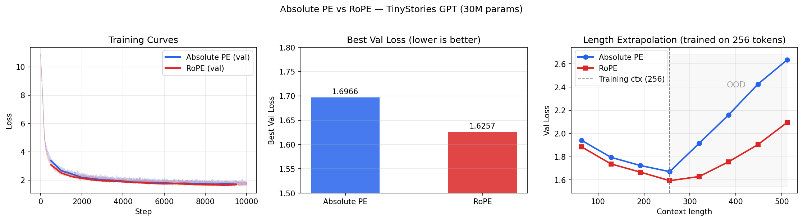

# Small-gpt

A decoder-only transformer (GPT-style) implemented from scratch in PyTorch —
no HuggingFace, no nanoGPT fork. Trained on TinyStories V2 and used as a
controlled testbed to compare two positional encoding schemes:
**absolute PE** (learned embeddings) vs **RoPE** (rotary position embedding).

> **Live demo:** [TinyStories GPT · Streamlit](https://small-gpt-npzhmufiehfy62ysdqpacg.streamlit.app/) ·
> **Model weights:** [Hugging Face Hub](https://huggingface.co/Mansi3110/tinystories-gpt)

---

## Key results



| | Absolute PE | RoPE |
|---|---|---|
| Val loss (10K steps) | 1.6792 | **1.6257** |
| Perplexity | 5.36 | **5.08** |
| Parameters | 30.0M | 29.9M |

**At 2× the training context (512 tokens, OOD):**

| Model | Perplexity at 256 | Perplexity at 512 | Increase |
|---|---|---|---|
| Absolute PE | 5.31 | 13.94 | +163% |
| RoPE | 4.90 | 8.10 | **+65%** |

RoPE achieves 5.2% lower perplexity under identical training conditions
and degrades 2.5× less gracefully beyond the training context length.
See [`RESULTS.md`](RESULTS.md) for the full comparison.

---

## What's implemented from scratch

- **Tokenization** — GPT-2 BPE via `tiktoken`, stored as uint16 binary files
- **Data pipeline** — memmap-based streaming dataloader, no full file load
- **Model** — token embeddings, causal multi-head self-attention, pre-norm residual
  blocks, MLP with GELU, weight-tied output head
- **Positional encoding** — absolute PE (learned) and RoPE (sin/cos rotation of Q/K),
  switchable via a single config flag
- **Training loop** — AdamW with parameter groups, linear warmup + cosine LR decay,
  gradient clipping, fp16 mixed precision, checkpoint saving
- **Evaluation** — val loss, perplexity, temperature sampling with top-k

---

## Model architecture

```
Input tokens (B, T)
       ↓
Token embeddings + [optional absolute PE]     ← RoPE skips this
       ↓
× 6 transformer blocks:
    LayerNorm → CausalSelfAttention [+ RoPE]  ← only line that differs
    LayerNorm → MLP (4× expansion, GELU)
    Residual connections throughout
       ↓
Final LayerNorm → output head (weight-tied with embeddings)
       ↓
Logits (B, T, 50257) → cross-entropy loss
```

| Hyperparameter | Value |
|---|---|
| Layers | 6 |
| Heads | 6 |
| d_model | 384 |
| Context length | 256 |
| Total params | ~30M |
| Non-embedding params | ~10.6M |

---

## Repository structure

```
small-gpt/
├── src/
│   ├── model.py          # GPTConfig, Embeddings, CausalSelfAttention, MLP, Block, GPT
│   ├── pos_enc.py        # precompute_rope, rotate_half, apply_rope
│   └── data.py           # load_tokens, get_batch (memmap-based)
├── scripts/
│   ├── tokenize_data.py  # download + tokenize TinyStories → .bin files
│   ├── train.py          # production training loop
│   ├── smoke_model.py    # verify model construction and loss at init
│   └── explore_data.py   # dataset statistics
├── results/
│   ├── comparison_plots.png
│   ├── extrapolation.json
│   ├── abs_pe_v1/log.json
│   └── rope_pe_v1/log.json
├── app.py                # Streamlit demo
├── RESULTS.md
├── requirements.txt
└── README.md
```

---

## Quickstart

**1. Install dependencies**
```bash
pip install torch tiktoken numpy tqdm matplotlib datasets streamlit huggingface_hub
```

**2. Prepare data** (downloads TinyStories, tokenizes to ~1 GB binary)
```bash
python scripts/tokenize_data.py
```

**3. Train**
```bash
python scripts/train.py
```
Default: 10,000 steps, batch 4, context 256, CPU. For GPU training, edit
`TrainConfig` at the bottom of `scripts/train.py` and set `device="cuda"`.

**4. Generate**
```python
import torch, tiktoken
from src.model import GPTConfig, GPT

ckpt  = torch.load("results/abs_pe_v1/best.pt", map_location="cpu")
model = GPT(GPTConfig(**ckpt["model_cfg"]))
model.load_state_dict(ckpt["model_state"])
model.eval()

enc  = tiktoken.get_encoding("gpt2")
x    = torch.tensor([enc.encode("Once upon a time")])
out  = model.generate(x, max_new_tokens=200, temperature=0.8, top_k=50)
print(enc.decode(out[0].tolist()))
```

---

## The experiment: RoPE vs absolute PE

The only code difference between the two models:

```python
# In CausalSelfAttention.forward — this is the entire change:
if hasattr(self, 'rope_cos'):
    from src.pos_enc import apply_rope
    q, k = apply_rope(q, k, self.rope_cos, self.rope_sin)
```

Switching between variants:
```python
cfg_abs  = GPTConfig(pos_encoding="absolute")   # default
cfg_rope = GPTConfig(pos_encoding="rope")
```

**Why the extrapolation result matters.** Absolute PE has a learned embedding for
each of 256 positions. At position 257, it receives an embedding it was never
trained to interpret — effectively random noise. RoPE applies the same sin/cos
rotation formula at every position; position 257 follows the same pattern as
position 1, just with a larger argument. The signal is systematic rather than
random, which explains the dramatically slower degradation beyond the training
context.

---

## Sample generations

**Prompt:** *"Once upon a time, there was a little girl named Lily."*

**Absolute PE** (val loss 1.68, perplexity 5.36)
> Once upon a time, there was a little girl named Lily. She had a big, modern box
> with many toys. One day, Lily was playing in her garden when she saw something
> strange. [...] From that day on, Lily and Tim played together every day. They
> learned that sharing and being kind made them happy. And they were the best of
> friends.

**RoPE** (val loss 1.63, perplexity 5.08)
> Once upon a time, there was a little girl named Lily. She had a big, modern box
> with her favorite things inside. One day, Lily went to play outside with her
> friend, Tom. As they played, Lily accidentally broke her box. [...] Lily and Tom
> were happy. They learned that helping others made everyone happy.

---

## References

- Eldan & Li (2023). [TinyStories: How Small Can Language Models Be and Still Speak Coherent English?](https://arxiv.org/abs/2305.07759)
- Su et al. (2021). [RoFormer: Enhanced Transformer with Rotary Position Embedding](https://arxiv.org/abs/2104.09864)
- Karpathy. [nanoGPT](https://github.com/karpathy/nanoGPT) — used as a reference after writing from scratch
